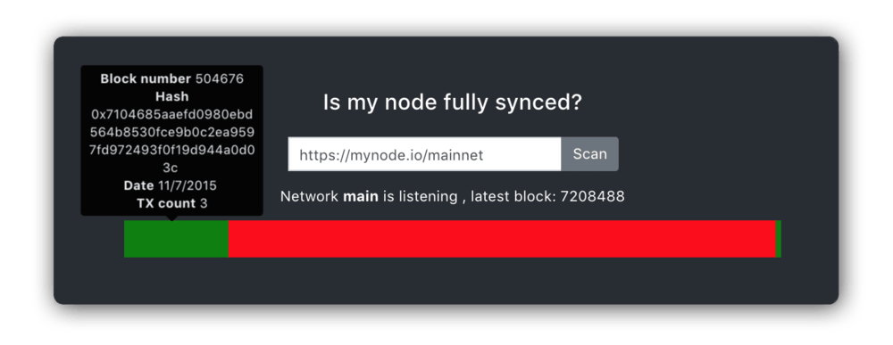

# Is my node fully synced?

Quickly check if you node is fully sync by providing a publicly accessible URL. Remember to add a protocol to the url!

The horizontal bar represents all blocks ranging from 0 (left) to latest block (right). Red areas means that there was an error checking that specific block, likely indicating that the node has not synced that range of blocks. You can hover your mouse on top of each checked block to see more details.

http://dapplion.github.io/is-my-node-fully-synced

  

